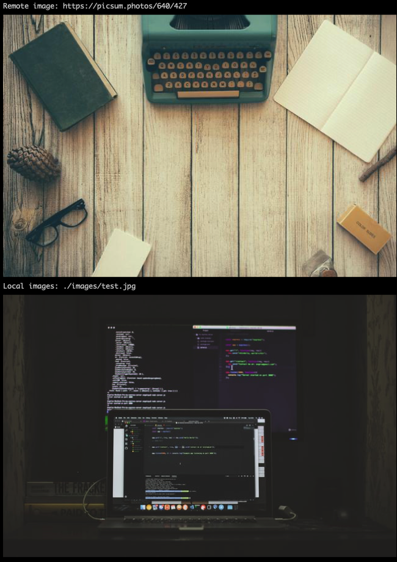

# print-image-cli

Tool to print inline images in supported terminals.

```javascript
const printImage = require('print-image-cli');

(async () => {
  const url = 'https://picsum.photos/640/427';
  const local = './images/test.jpg';

  console.log('Remote image:', url);
  await printImage(url);

  console.log('Local images:', local);
  await printImage(local);
})();
```


